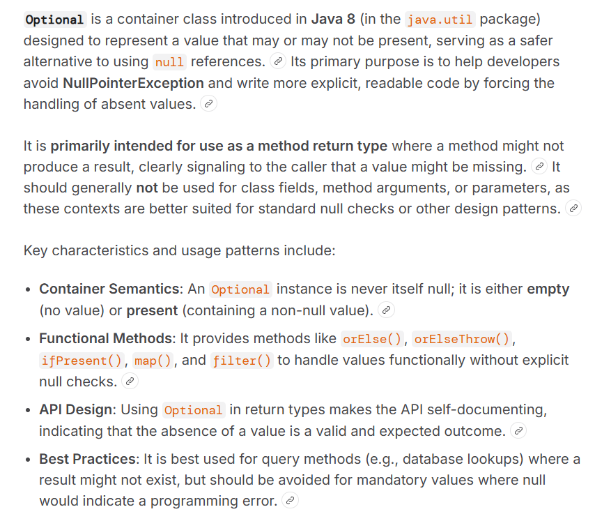
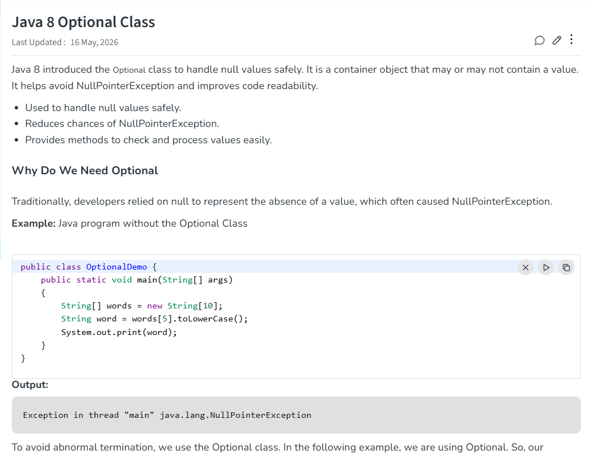
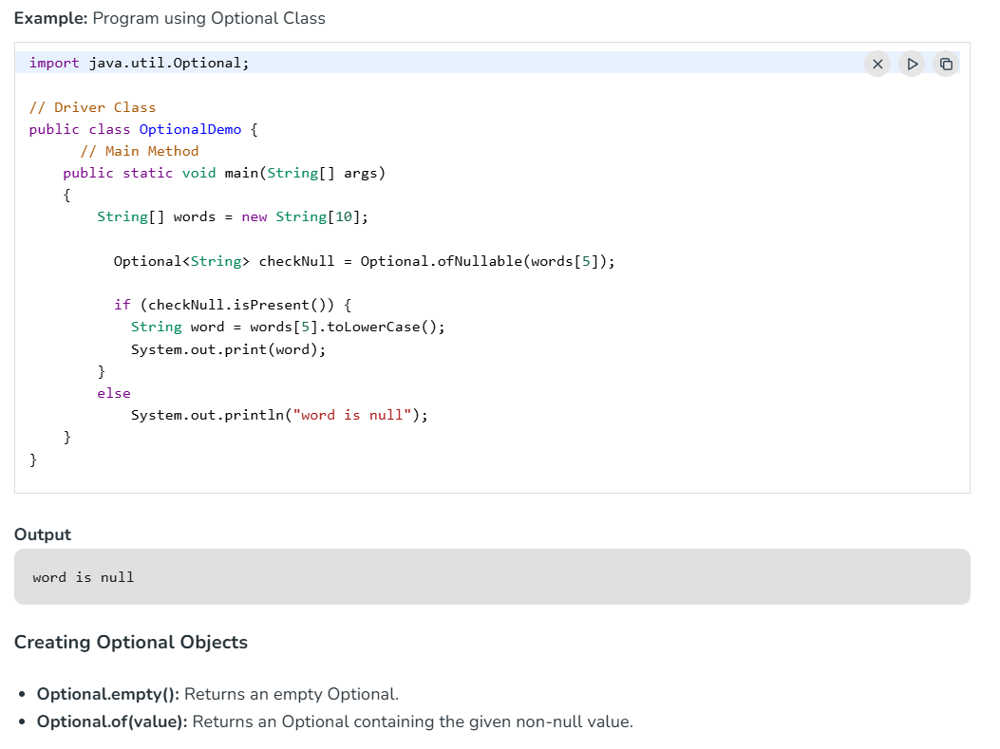
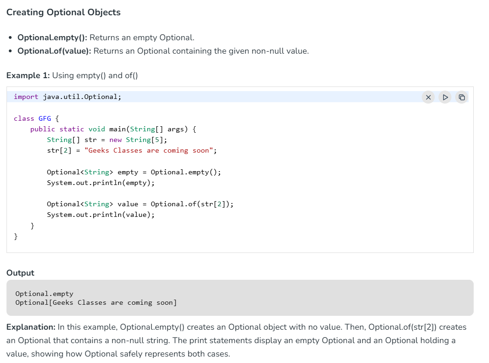
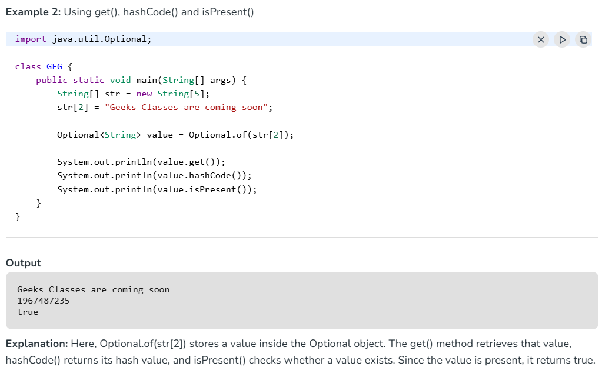
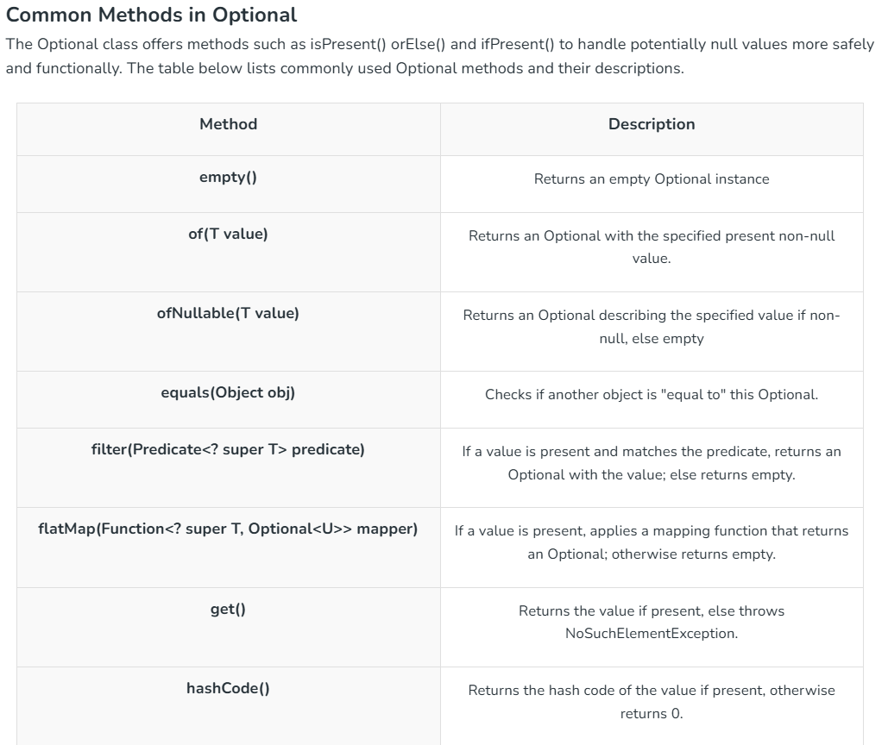
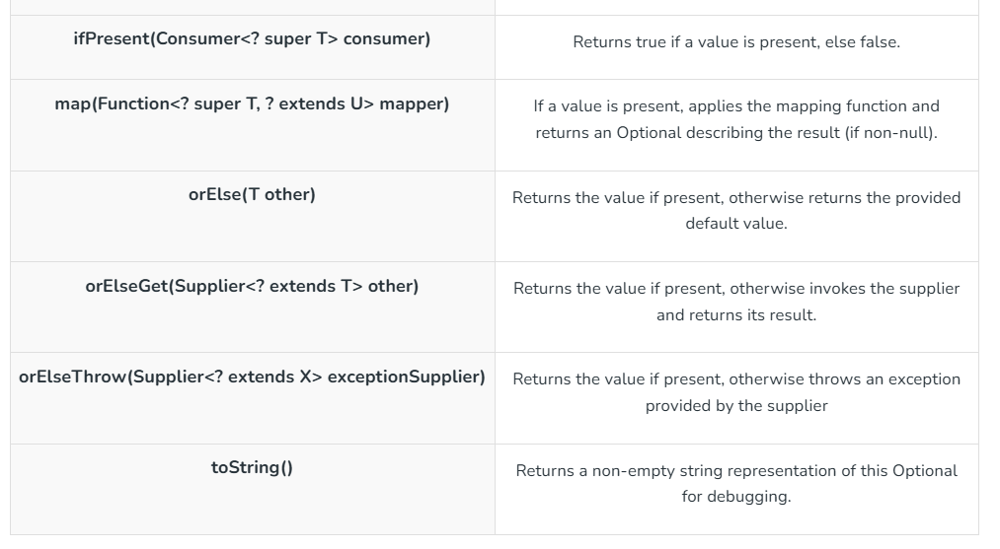

---





---




---

###  ofNullable() vs of()

`Optional.ofNullable()` creates an `Optional` object that **may or may not contain a non-null value**.

It prevents `NullPointerException` (NPE) by wrapping a variable that could potentially be `null`.

---

**How It Works**

* If the passed value is **non-null**, it returns an `Optional` containing that value.
* If the passed value is **null**, it returns an empty `Optional` (`Optional.empty()`) instead of throwing a `NullPointerException`.

---

**`ofNullable()` vs `of()**`

| Method | Behavior with `null` | When to Use |
| --- | --- | --- |
| `Optional.of(value)` | Throws `NullPointerException` | When you are **100% sure** the value is never `null`. |
| `Optional.ofNullable(value)` | Returns `Optional.empty()` | When the value **might be null**. |

---

**Example Code**

```java
import java.util.Optional;

public class OfNullableExample {
    public static void main(String[] args) {
        String name = getUsername(); // Might return null

        // Safe creation without risk of NullPointerException
        Optional<String> nameOptional = Optional.ofNullable(name);

        // Provide a default fallback value if null
        String displayName = nameOptional.orElse("Guest");

        System.out.println("Hello, " + displayName);
    }

    private static String getUsername() {
        return null; // Simulating a missing value
    }
}

```

---

**Common Use Cases**

* **Avoiding Manual `if (x != null)` Checks:**
```java
// Traditional way
if (user != null && user.getAddress() != null) { ... }

// Modern Java way
String city = Optional.ofNullable(user)
                      .map(User::getAddress)
                      .map(Address::getCity)
                      .orElse("Unknown");

```


* **Handling Legacy API Returns:** When calling third-party libraries or standard methods that might return `null`.

