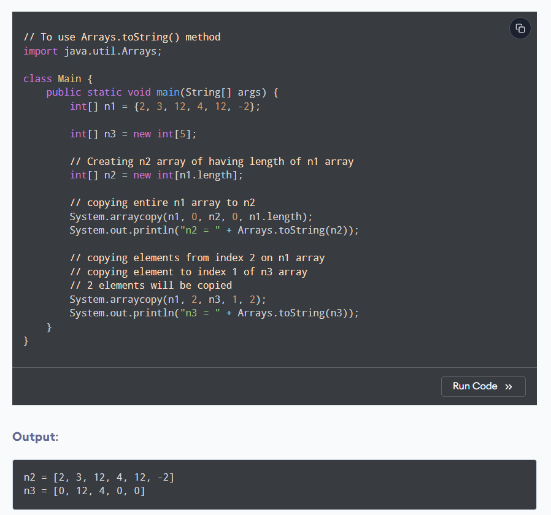

"arraycopy()"This is an inbuilt function used to copy contents from one array to another array.

In the above example, we have used the arraycopy() method,

System.arraycopy(n1, 0, n2, 0, n1.length) - entire elements from the n1 array are copied to n2 array
System.arraycopy(n1, 2, n3, 1, 2) - 2 elements of the n1 array starting from index 2 are copied to the index starting from 1 of the n3 array
As you can see, the default initial value of elements of an int type array is 0.