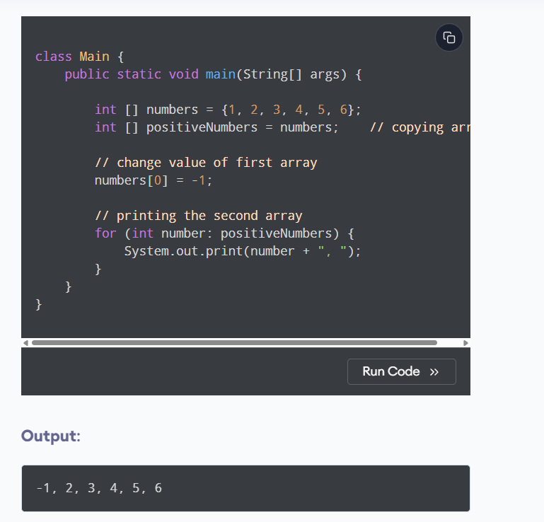

Here, we can see that we have changed one value of the numbers array. When we print the positiveNumbers array, we can see that the same value is also changed.

It's because both arrays refer to the same array object. This is because of the shallow copy.