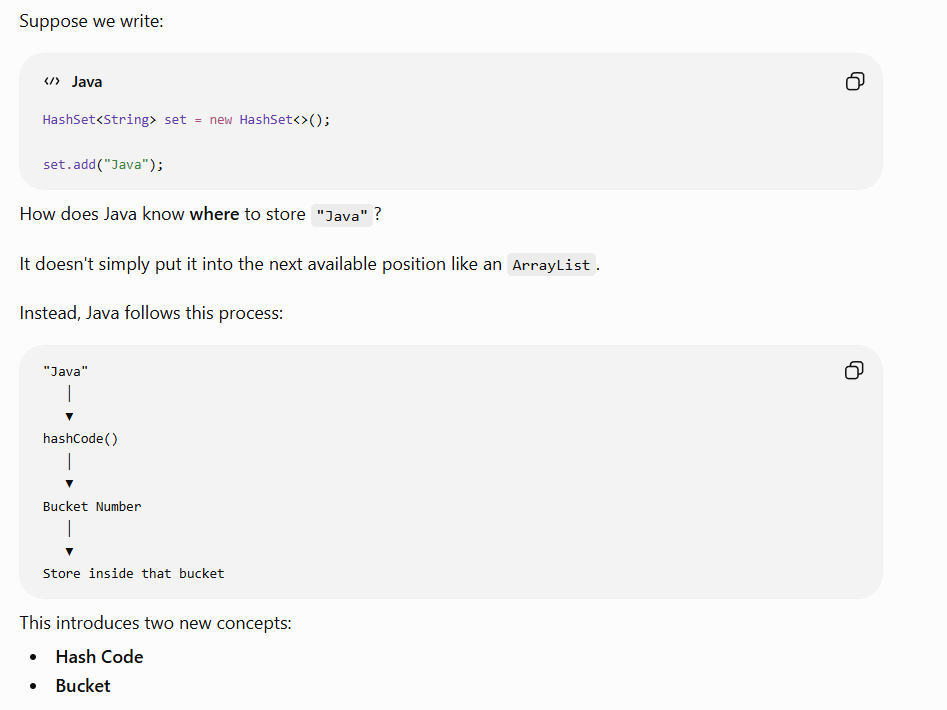
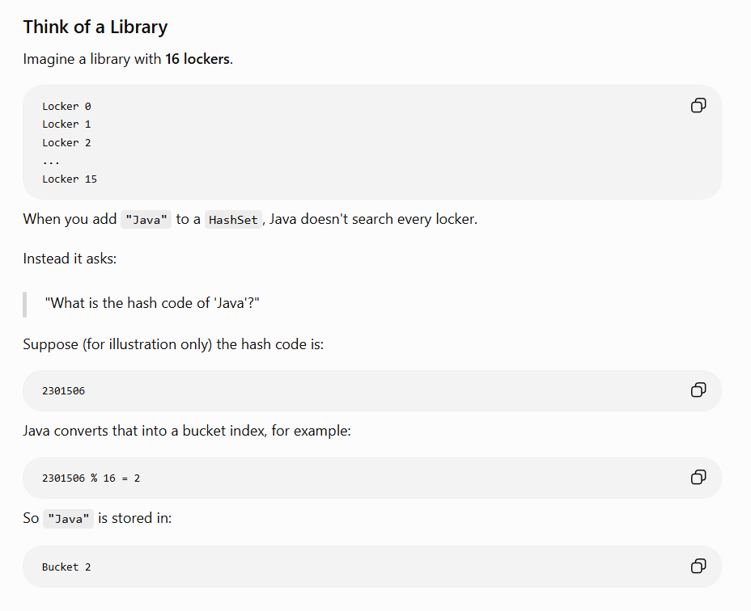
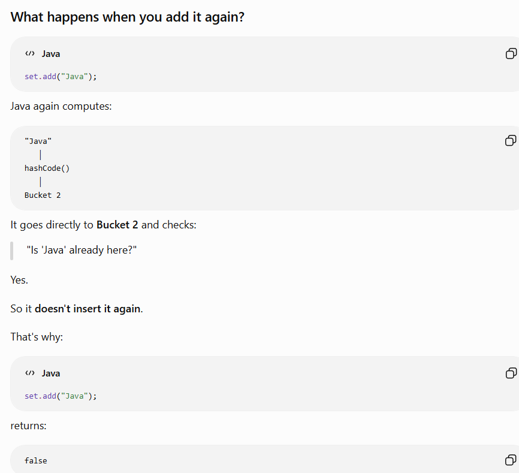

  






We'll learn:

1. Why HashSet is fast
2. What is Hashing?
3. What is a Hash Code?
4. What are Buckets?
5. How HashSet stores data
6. How duplicates are detected
7. `hashCode()` and `equals()`
8. Hash Collision
9. Why both methods are needed
10. Interview Questions

---

# Step 1: How does ArrayList search?

Suppose we have:

```text
Index

0  Java
1  SQL
2  Spring
3  React
```

Now we ask:

```java
list.contains("React");
```

Java checks:

```text
Java ❌

↓

SQL ❌

↓

Spring ❌

↓

React ✅
```

It searches one by one.

Time Complexity:

```text
O(n)
```

---

# Step 2: How does HashSet search?

Suppose

```java
set.add("Java");
```

HashSet **doesn't** search the whole collection.

Instead it does:

```text
Java

↓

hashCode()

↓

Bucket Number

↓

Store
```

Later

```java
set.contains("Java");
```

Again

```text
Java

↓

hashCode()

↓

Same Bucket

↓

Check only there
```

Not the entire set.

This is why HashSet is usually

```text
O(1)
```

---

# Step 3: What is Hashing?

Hashing is simply

> **Converting an object into a number.**

Example

```java
"Java"
```

might produce

```text
2301506
```

That number is called its

# Hash Code

---

# Step 4: What is hashCode()?

Every object in Java has a method called

```java
hashCode()
```

Example

```java
String s = "Java";

System.out.println(s.hashCode());
```

Possible Output

```text
2301506
```

Every string has its own hash code.

Example

```java
System.out.println("Java".hashCode());

System.out.println("SQL".hashCode());

System.out.println("React".hashCode());
```

Outputs different numbers.

---

# Step 5: Buckets

Imagine a hotel with 16 rooms.

```text
Bucket 0

Bucket 1

Bucket 2

Bucket 3

...

Bucket 15
```

Now

```text
Java

↓

hashCode()

↓

2301506
```

Java converts that into a bucket number.

For simplicity imagine:

```text
2301506 % 16

=

2
```

So

```text
Bucket 2

↓

Java
```

Stored.

---

# Step 6: Searching

Later

```java
set.contains("Java");
```

Again

```text
Java

↓

hashCode()

↓

Bucket 2
```

Java directly goes to

```text
Bucket 2
```

instead of checking every bucket.

Huge performance improvement.

---

# Step 7: Duplicate Detection

Suppose

```java
set.add("Java");
```

Stored.

Again

```java
set.add("Java");
```

Java does

```text
Java

↓

hashCode()

↓

Bucket 2
```

Now it checks

```text
Is Java already inside Bucket 2 ?
```

Yes.

So

```java
add()
```

returns

```text
false
```

No duplicate stored.

---

# Step 8: Wait...

What if two different objects produce the same bucket?

Example

```text
Apple

↓

Bucket 3
```

and

```text
Orange

↓

Bucket 3
```

This is called

# Hash Collision

---

# Step 9: Hash Collision

Example

```text
Bucket 3

↓

Apple

↓

Orange
```

Now Java cannot decide using hash code alone.

It needs another check.

This is where

```java
equals()
```

comes in.

---

# Step 10: equals()

Suppose

```java
String a = "Java";

String b = "Java";
```

Java checks

```java
a.equals(b)
```

Output

```text
true
```

Now

```java
String a = "Java";

String b = "SQL";
```

Output

```text
false
```

---

# How HashSet Uses Both

When adding an element:

```text
Object

↓

hashCode()

↓

Bucket

↓

equals()

↓

Duplicate ?

↓

Reject

or

Store
```

Notice

HashSet **does not use only hashCode()**.

It uses

```text
hashCode()

+

equals()
```

---

# Why Both?

Imagine

```text
Apple

↓

Bucket 5
```

Orange also goes to

```text
Bucket 5
```

Hash codes are the same.

If Java only checked hash code,

it would think

```text
Apple == Orange
```

Wrong.

So after finding the bucket,

Java asks

```java
equals()
```

Only if

```java
equals()
```

returns

```text
true
```

does Java reject it as a duplicate.

Otherwise

it stores both.

---

# Complete Internal Flow

```text
add("Java")

↓

hashCode()

↓

Bucket 4

↓

Is Bucket Empty?

↓

YES

↓

Store
```

---

Second insertion

```text
add("Java")

↓

hashCode()

↓

Bucket 4

↓

Java already there?

↓

equals()

↓

true

↓

Don't Store
```

---

Different object

```text
add("SQL")

↓

hashCode()

↓

Bucket 4

↓

equals()

↓

false

↓

Store
```

---

# Real Interview Question

Which method is called first?

```text
hashCode()

↓

equals()
```

Always remember this order.

Java first calculates the hash code, then (if needed) uses `equals()` to compare with existing elements in the same bucket.

---

# Time Complexity

| Operation     | Complexity   |
| ------------- | ------------ |
| hashCode()    | O(1)         |
| Bucket Search | O(1) Average |
| equals()      | O(1) Average |

Overall

```text
O(1)
```

Average case.

---

# Interview Questions

### Q1

Why is HashSet faster than ArrayList?

---

### Q2

What is hashing?

---

### Q3

What is a hash collision?

---

### Q4

Which method is called first?

* equals()
* hashCode()

---

### Q5

Can two different objects have the same hash code?

Answer:

✅ Yes.

This is exactly what causes collisions.

---
