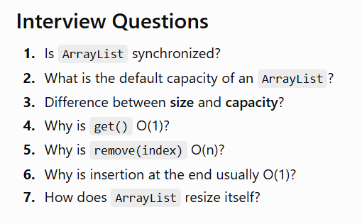

These are exactly the **ArrayList interview questions** you should know. I'll explain them so you can understand the reason behind each answer rather than memorize them.

# 1. What is the default capacity of an ArrayList?

There is an important distinction here.

When you write:

```java
ArrayList<String> list = new ArrayList<>();
```

in modern Java, the internal storage initially uses an **empty array**. On the **first element addition**, it grows to a capacity of **10**.

So for interviews, a precise answer is:

> The default initial capacity used when the first element is added is **10**, although a newly constructed empty `ArrayList` does not immediately allocate an array of size 10.

Your roadmap expects you to know collections and their practical behavior. 

You can also explicitly specify capacity:

```java
ArrayList<String> list = new ArrayList<>(20);
```

Here the initial capacity is:

```text
20
```

---

# 2. Difference Between Size and Capacity

This is very important.

Suppose:

```java
ArrayList<String> list = new ArrayList<>();

list.add("Apple");
list.add("Banana");
list.add("Mango");
```

There are currently **3 elements**.

So:

```text
Size = 3
```

The backing array may have room for more elements.

### Size

**Size = number of elements currently stored.**

You can get it using:

```java
list.size();
```

### Capacity

**Capacity = number of elements the internal backing array can currently hold before another resize is needed.**

Think about a bus:

```text
Bus seats = 50
Passengers = 20
```

Then:

```text
Capacity = 50
Size = 20
```

For an ArrayList:

```text
Internal capacity = 10
Elements stored   = 3

[10][20][30][ ][ ][ ][ ][ ][ ][ ]
 ↑
Size = 3

<---------- 10 ---------->
        Capacity
```

One important point: normal `ArrayList` API gives you `size()`, but there isn't a normal public `capacity()` method.

### Interview answer

> Size represents the number of elements currently present in an ArrayList, while capacity represents the size of its internal backing array.

---

# 3. Why is `get()` O(1)?

Suppose:

```java
ArrayList<String> fruits = new ArrayList<>();

fruits.add("Apple");
fruits.add("Banana");
fruits.add("Mango");
fruits.add("Orange");
```

Internally:

```text
Index     Value

0         Apple
1         Banana
2         Mango
3         Orange
```

Now:

```java
fruits.get(2);
```

Java doesn't search:

```text
Apple?
No

Banana?
No

Mango?
Yes
```

Instead, because `ArrayList` uses an array internally, Java directly accesses index `2`.

Conceptually:

```text
InternalArray[2]
```

Therefore:

```text
get(index) → O(1)
```

Whether there are:

```text
10 elements
100 elements
10,000 elements
1,000,000 elements
```

accessing a valid index is still direct access.

### Interview answer

> `ArrayList.get(index)` is O(1) because ArrayList uses an array internally and arrays support direct/random access by index.

---

# 4. Why is `remove(index)` O(n)?

Now suppose:

```text
Index

0 Apple
1 Banana
2 Mango
3 Orange
4 Grapes
```

Execute:

```java
list.remove(1);
```

We remove:

```text
Banana
```

But Java can't simply leave:

```text
Apple
EMPTY
Mango
Orange
Grapes
```

The list must remain continuous.

So elements after Banana shift left:

```text
Before

0 Apple
1 Banana
2 Mango
3 Orange
4 Grapes


Remove Banana


After

0 Apple
1 Mango
2 Orange
3 Grapes
```

Internally:

```text
Mango   → shift left
Orange  → shift left
Grapes  → shift left
```

If the list contains a huge number of elements, Java may have to shift many of them.

Therefore:

```text
remove(index) → O(n)
```

Technically, removing the **last** element doesn't require shifting and is effectively O(1), but the general/worst-case complexity for indexed removal is **O(n)**.

### Interview answer

> Removing an element from an ArrayList is generally O(n) because elements after the removed position must be shifted one position to the left.

---

# 5. Why is insertion at the end usually O(1)?

Consider:

```java
list.add("Apple");
list.add("Banana");
list.add("Mango");
```

Imagine the backing array has free space:

```text
[Apple][Banana][Mango][ ][ ][ ][ ][ ][ ][ ]
```

Now:

```java
list.add("Orange");
```

Java simply puts Orange into the next available location:

```text
[Apple][Banana][Mango][Orange][ ][ ][ ][ ][ ][ ]
```

No existing elements need to move.

Therefore it's basically:

```text
Find next position
       ↓
Insert element
```

So:

```text
add(element) → O(1)
```

But notice I said **usually**.

Suppose the array becomes full:

```text
[A][B][C][D][E][F][G][H][I][J]
```

and you add:

```java
list.add("K");
```

There is no space.

Now ArrayList must resize.

That operation involves copying existing elements and is O(n).

That's why we say:

> Adding at the end of an ArrayList is **O(1) amortized**.

"Amortized" means that most additions are O(1), while occasional additions are expensive due to resizing; averaged across many additions, the cost per addition remains effectively constant.

---

# 6. How does ArrayList resize itself?

This connects everything together.

Imagine capacity is:

```text
10
```

and the ArrayList is full:

```text
[A][B][C][D][E][F][G][H][I][J]
```

Now you try:

```java
list.add("K");
```

There is no room.

ArrayList performs several steps.

### Step 1 — Detect full capacity

Java realizes:

```text
size == capacity
```

It needs more space.

### Step 2 — Create a larger backing array

For typical growth in current Java implementations, the new capacity is roughly **1.5×** the old capacity.

Conceptually:

```text
newCapacity =
oldCapacity + oldCapacity / 2
```

So:

```text
10
 ↓
15
```

Later approximately:

```text
15
 ↓
22
 ↓
33
 ↓
49
...
```

Exact growth can vary for edge cases and implementation details, so think of **~1.5×** rather than relying on every number.

### Step 3 — Copy existing elements

Old:

```text
[A][B][C][D][E][F][G][H][I][J]
```

New:

```text
[A][B][C][D][E][F][G][H][I][J][ ][ ][ ][ ][ ]
```

All existing references are copied into the larger array.

### Step 4 — Add the new element

Now:

```text
[A][B][C][D][E][F][G][H][I][J][K][ ][ ][ ][ ]
```

### Step 5 — Old backing array becomes eligible for garbage collection

The `ArrayList` now uses the new backing array.

Conceptually:

```text
OLD ARRAY
Capacity 10
     ↓
Array becomes full
     ↓
Create larger array
     ↓
Copy elements
     ↓
Add new element
     ↓
Continue using new array
```

---

# Put All 6 Answers Together

Keep this table in your notes:

| Question                | Answer                                                      |
| ----------------------- | ----------------------------------------------------------- |
| Default capacity        | First insertion normally expands default-created list to 10 |
| Size                    | Number of elements stored                                   |
| Capacity                | Current backing-array capacity                              |
| `get(index)`            | O(1)                                                        |
| Why `get()` O(1)?       | Direct array/index access                                   |
| `remove(index)`         | O(n) generally                                              |
| Why removal O(n)?       | Elements need shifting                                      |
| `add(element)`          | O(1) amortized                                              |
| Why end insertion fast? | Usually no shifting                                         |
| Resizing                | Larger array created and elements copied                    |
| Typical growth          | Roughly 1.5×                                                |

## One interview trap you should remember

Don't say:

> "`ArrayList.add()` is always O(1)."

Say:

> "`ArrayList.add()` at the end is **O(1) amortized** because most insertions don't require resizing, but occasionally the backing array must grow and existing elements must be copied."

That distinction shows you actually understand `ArrayList`.

At this point you understand the important internal behavior of **ArrayList**. The next logical topic is **iteration techniques (`for`, enhanced `for`, `Iterator`, `ListIterator`, `forEach`)**, and after that we can move into **LinkedList**, where we'll compare its internal structure directly against ArrayList.


----


# Interview Question

```java
Vector<String> v = new Vector<>();

v.add("A");

v.add("B");

v.add("C");
```

What is the output?

```java
System.out.println(v.capacity());
```

Can you answer?

---

# Another Interview Question

What is the difference between

```java
v.size();
```

and

```java
v.capacity();
```

---
