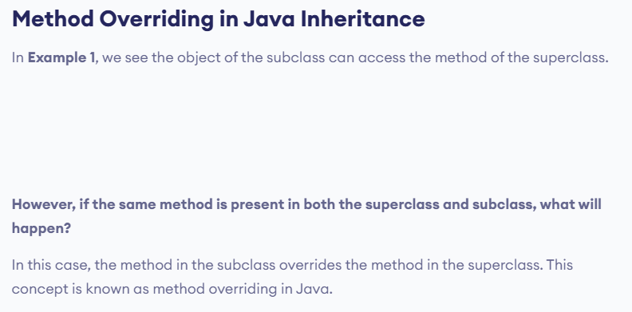
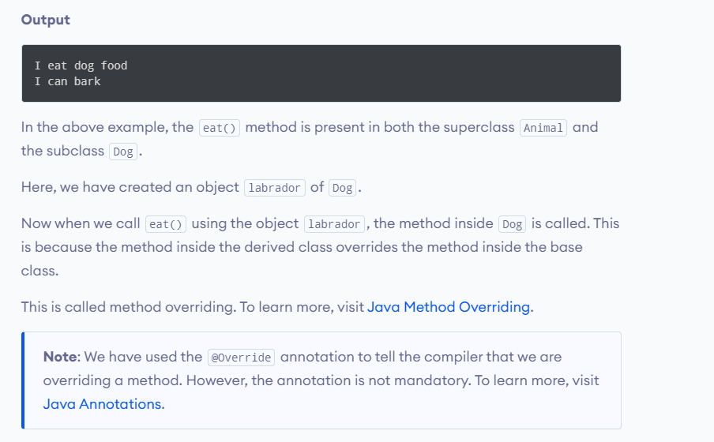
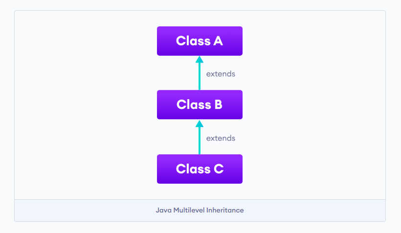
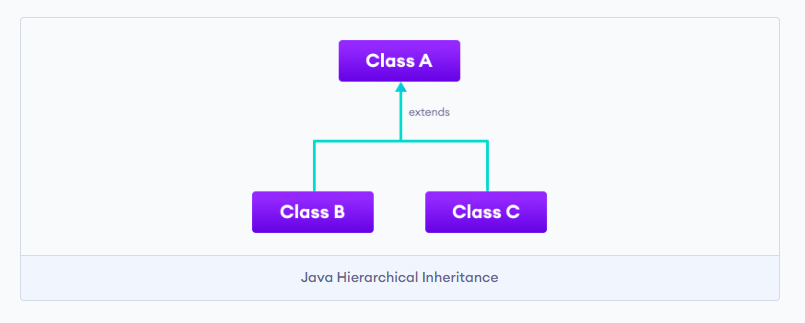
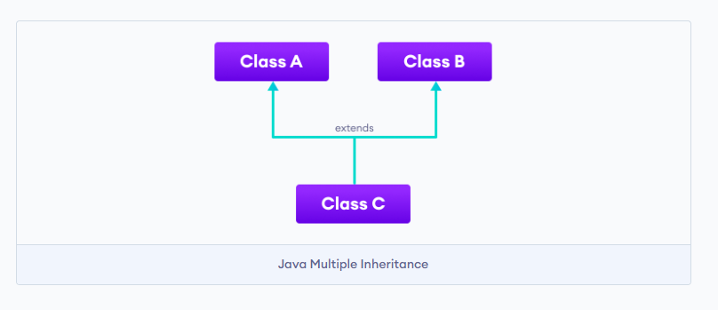
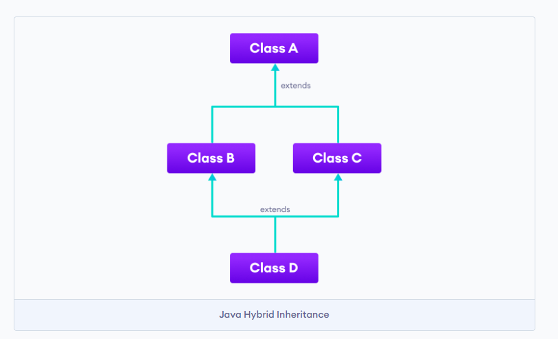

     

here we can see the static variable can be directly called using the class name "Test.max" ; but to call the non-static varaible we need to create constructor and then we have to call it using the object of the constructor "obj.min".

Example 1 : Java inheritance

class Animal {

  // field and method of the parent class
  String name;
  public void eat() {
    System.out.println("I can eat");
  }
}

// inherit from Animal
class Dog extends Animal {

  // new method in subclass
  public void display() {
    System.out.println("My name is " + name);
  }
}

class Main {
  public static void main(String[] args) {

    // create an object of the subclass
    Dog labrador = new Dog();

    // access field of superclass
    labrador.name = "Rohu";
    labrador.display();

    // call method of superclass
    // using object of subclass
    labrador.eat();

  }
}

------------
Output

My name is Rohu
I can eat
In the above example, we have derived a subclass Dog from superclass Animal. Notice the statements,

labrador.name = "Rohu";

labrador.eat();
Here, labrador is an object of Dog. However, name and eat() are the members of the Animal class.

Since Dog inherits the field and method from Animal, we are able to access the field and method using the object of the Dog.

---------------

Exaple 2 : method overriding  in java inheritence

class Animal {

  // method in the superclass
  public void eat() {
    System.out.println("I can eat");
  }
}

// Dog inherits Animal
class Dog extends Animal {

  // overriding the eat() method
  @Override
  public void eat() {
    System.out.println("I eat dog food");
  }

  // new method in subclass
  public void bark() {
    System.out.println("I can bark");
  }
}

class Main {
  public static void main(String[] args) {

    // create an object of the subclass
    Dog labrador = new Dog();

    // call the eat() method
    labrador.eat();
    labrador.bark();
  }
}

Example 3 : Inheritence (super Keyword )

class Animal {

  // method in the superclass
  public void eat() {
    System.out.println("I can eat");
  }
}

// Dog inherits Animal
class Dog extends Animal {

  // overriding the eat() method
  @Override
  public void eat() {

    // call method of superclass
    super.eat();
    System.out.println("I eat dog food");
  }

  // new method in subclass
  public void bark() {
    System.out.println("I can bark");
  }
}

class Main {
  public static void main(String[] args) {

    // create an object of the subclass
    Dog labrador = new Dog();

    // call the eat() method
    labrador.eat();
    labrador.bark();
  }
} 

Output

I can eat
I eat dog food
I can bark 

In the above example, the eat() method is present in both the base class Animal and the derived class Dog. Notice the statement,

super.eat();

Here, the super keyword is used to call the eat() method present in the superclass.

-------------------
Why use inheritance?

-The most important use of inheritance in Java is code reusability. The code that is present in the parent class can be directly used by the child class.
-Method overriding is also known as runtime polymorphism. Hence, we can achieve Polymorphism in Java with the help of inheritance.

Types of inheritance:

There are five types of inheritance.

1. Single Inheritance
In single inheritance, a single subclass extends from a single superclass. For example,

2. Multilevel Inheritance
In multilevel inheritance, a subclass extends from a superclass and then the same subclass acts as a superclass for another class. For example,

3. Hierarchical Inheritance
In hierarchical inheritance, multiple subclasses extend from a single superclass. For example,

4. Multiple Inheritance
In multiple inheritance, a single subclass extends from multiple superclasses. For example,

5. Hybrid Inheritance
Hybrid inheritance is a combination of two or more types of inheritance. For example,

