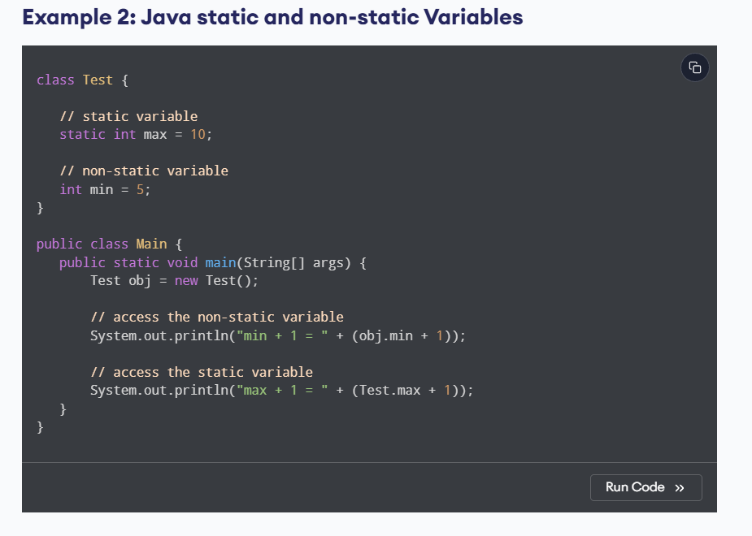

     

here we can see the static variable can be directly called using the class name "Test.max" ; but to call the non-static varaible we need to create constructor and then we have to call it using the object of the constructor "obj.min".

Example 1 : Java inheritance

class Animal {

  // field and method of the parent class
  String name;
  public void eat() {
    System.out.println("I can eat");
  }
}

// inherit from Animal
class Dog extends Animal {

  // new method in subclass
  public void display() {
    System.out.println("My name is " + name);
  }
}

class Main {
  public static void main(String[] args) {

    // create an object of the subclass
    Dog labrador = new Dog();

    // access field of superclass
    labrador.name = "Rohu";
    labrador.display();

    // call method of superclass
    // using object of subclass
    labrador.eat();

  }
}

